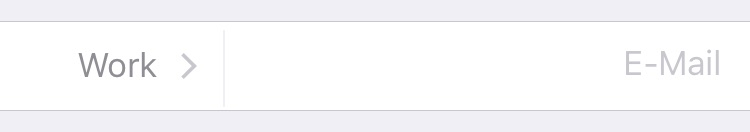

# SplitRow
A row for Eureka to put two rows side by side into the same UITableViewCell.

<p align="left">

<a href="https://developer.apple.com/swift"></a>
<a href="https://github.com/Carthage/Carthage"></a>
<a href="https://cocoapods.org/pods/SplitRow"></a>
<a href="https://raw.githubusercontent.com/EurekaCommunity/SplitRow/master/LICENSE"></a>
</p>

By [MANDELKIND](http://mandelkind.swiss).

## Contents
 * [Introduction](#introduction)
 * [Installation](#Installation)
 * [Usage](#usage)
 * [Requirements](#requirements)
 * [Getting involved](#getting-involved)

## Introduction

`SplitRow` is a custom row for Eureka designed to put two rows side by side into the same UITableViewCell.



## Installation

#### CocoaPods

[CocoaPods](https://cocoapods.org/) is a dependency manager for Cocoa projects.

Specify Eureka into your project's `Podfile`:

```ruby
source 'https://github.com/CocoaPods/Specs.git'
platform :ios, '10.0'
use_frameworks!

pod 'SplitRow'
```

Then run the following command:

```bash
$ pod install
```

#### Carthage

[Carthage](https://github.com/Carthage/Carthage) is a simple, decentralized dependency manager for Cocoa.

Specify SplitRow into your project's `Cartfile`:

```
github "EurekaCommunity/SplitRow" ~> 2.0.0
```

Then run the following command:

```bash
$ carthage bootstrap --platform iOS
```

## Usage

```swift
import Eureka
import SplitRow

class ViewController: FormViewController {

    override func viewDidLoad() {
        super.viewDidLoad()

        form +++ Section()
            <<< SplitRow<PushRow<String>,TextRow>(){
		$0.rowLeft = PushRow<String>(){
			$0.selectorTitle = "E-Mail"
			$0.options = ["Private","Work","Others"]
		}

		$0.rowRight = TextRow(){
			$0.placeholder = "E-Mail"
		}

		}.onChange{
			print("SplitRow.onChange:","left:",$0.value?.left,"right:",$0.value?.right)
		}
    }
}
```

Example by changing the percentage of the row on the right

```swift
import Eureka
import SplitRow

class ViewController: FormViewController {

    override func viewDidLoad() {
        super.viewDidLoad()

        form +++ Section()
            <<< SplitRow<PushRow<String>,TextRow>(){
		$0.rowLeftPercentage = 0.5
			$0.rowLeft = PushRow<String>(){
			$0.selectorTitle = "E-Mail"
			$0.options = ["Private","Work","Others"]
		}
					
		$0.rowRight = TextRow(){
			$0.placeholder = "E-Mail"
		}
				
        	}.onChange{
        		print("SplitRow.onChange:","left:",$0.value?.left,"right:",$0.value?.right)
        	}
    }
}
```

## Requirements

* iOS 10.0+
* Xcode 9.0+
* Eureka ~> 5.0

## Getting involved

* If you **want to contribute** please feel free to **submit pull requests**.
* If you **have a feature request** please **open an issue**.

## Author

* [Marco Betschart](https://github.com/marbetschar)
